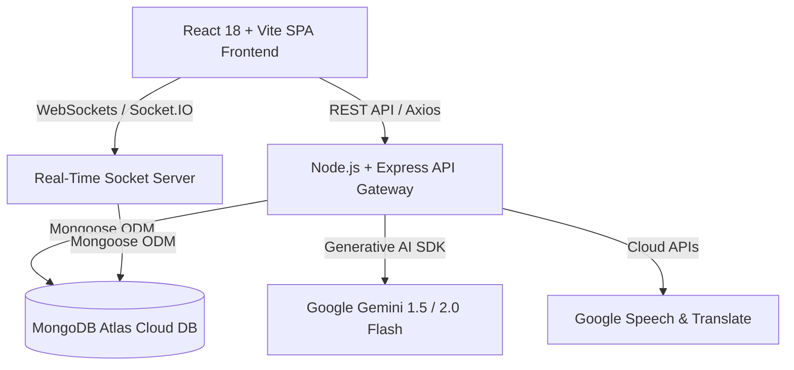

# 🚀 Career 2.0 — AI-Powered Digital Livelihood Platform

> **Empowering senior citizens, homemakers, and artisans across India to discover, monetize, and deliver their skills with dignity, safety, and modern AI tools.**

---

## 🔑 Demo Access Credentials (Instant Login)

Use these pre-configured credentials to test both sides of the platform immediately:

| Persona / Role | Mobile Number (`Phone`) | Password | Description & Permissions |
|---|---|---|---|
| 💼 **Job Provider / Employer** | `1234567890` | `123456` | Post job opportunities, review applications, hire seekers, chat with applicants |
| 👵 **Job Seeker / Senior Citizen** | `8667415174` | `123456` | AI skill discovery, browse opportunities, apply for work, list artisan products, chat |

> 💡 *Quick Tip: You can open two browser windows (or one regular and one incognito) to test two-way real-time messaging, application reviews, and booking workflows simultaneously!*

---

## ✨ Project Overview & Key Features

**Career 2.0** is an inclusive digital livelihood and gig-enablement platform specially tailored for seniors (60+), homemakers, and traditional artisans. It removes digital barriers through voice-first interactions, senior-friendly typography, regional language translations, and AI matching.

### 🧠 1. AI-Powered Skill Discovery & Assessment
- **Voice & Regional Language Input**: Senior citizens and homemakers can speak naturally in Tamil, Hindi, Telugu, or English.
- **Informal Experience Translation**: Converts life experiences (e.g., *"I have cooked for family weddings for 20 years"*) into structured, monetizable skills (*Catering, South Indian Culinary Arts, Menu Planning*).
- **Market Rate Pricing Guidance**: AI estimates fair hourly/per-session rates aligned with local market standards.

### 🎯 2. Contextual AI Match Scoring & Smart Opportunities
- **Contextual Job Matching**: Matches job seekers to nearby postings with a match percentage score and explanatory reasoning (e.g., *"96% Match — Highly matches your Cooking and Catering experience"*).
- **Rich Filters & Search**: Filter by categories (Cooking, Tailoring, Tutoring, Handicrafts, Elder Care), job type (Part-time, One-time, Flexible), and location radius.
- **One-Click Inquire & Apply**: Pre-fills courteous, respectful introductory drafts for job seekers.

### 💬 3. Real-Time Two-Way Chat & Instant AI Translation
- **WebSocket & REST Synchronization**: Fast Socket.IO messaging with persistent cloud storage fallback.
- **On-Demand Tamil Translation**: Built-in 🌐 **Translate** button translates messages to Tamil with a single tap for elder accessibility.
- **Accurate Local Timestamps**: Dynamically formats timestamps according to the user's timezone without hardcoded fallbacks.
- **Dynamic Bubble Alignment**: Clear WhatsApp-style message layout with sender name headers, read receipts (sent, delivered, read), and job context banners.

### 💼 4. Job Provider Hub & Applicant Management
- **One-Click Job Posting**: Post listings with AI-assisted title suggestions and description formatting.
- **Applicant Review Workflow**: Accept, decline, or message applicants directly with instant status badges.
- **Applicant Profile Cards**: View verified experience, ratings, completed gigs, and certificates.

### 🏺 5. SilverMarket — Traditional Artisan Marketplace
- **Handmade Product Showcase**: Artisans can list homemade pickles, pottery, handcrafted diyas, tailored clothing, and puja items.
- **Direct Order & Inquiry**: Customers can chat with artisans to customize orders and request delivery details.

### 📅 6. Booking Management & Safe Service Delivery
- **Full Booking Lifecycle**: Pending $\rightarrow$ Confirmed $\rightarrow$ In Progress $\rightarrow$ Completed.
- **OTP Verification & Milestone Tracking**: Ensures secure task completion before releasing funds.
- **Transparent Ratings & Reviews**: Builds reputation and community trust without fake reviews.

### 📈 7. Earnings & Financial Independence Dashboard
- **Real-Time Earnings Tracker**: Track monthly income, completed gig counts, and pending disbursements.
- **Instant UPI Payouts**: Connect bank accounts or UPI IDs for reliable payouts.

### 👵 8. Senior-First Accessibility & Safety Design
- **High Legibility**: 18px base font, high-contrast palette, and minimum 48×48px touch targets.
- **Emergency Safety SOS**: 1-click emergency assistance button, safety helpline integration, and verified badge verification.

---

## 🛠️ Technology Stack & Architecture



- **Frontend**: React 18, Vite, Tailwind CSS, Lucide React, Socket.IO Client
- **Backend**: Node.js, Express, Socket.IO, Helmet, Express Rate Limiting, JSON Web Tokens (JWT), Bcrypt.js
- **Database**: MongoDB Atlas (Cloud Database with Mongoose ODM)
- **AI / Cloud Services**: Google Gemini API, Google Cloud Translation API, Web Speech API

---

## 🚀 Quick Start (Local Setup)

### Prerequisites
- **Node.js**: v18.0.0 or higher
- **npm**: v9.0.0 or higher
- **Git**

### 1. Clone the Repository
```bash
git clone https://github.com/mridulvermar/mavericks_hackathon.git
cd mavericks_hackathon
```

### 2. Configure Environment Variables

#### Server Environment (`server/.env`)
Create `server/.env` with the following:
```env
PORT=5050
CLIENT_URL=http://localhost:5173
JWT_SECRET=silverhands_dev_secret_change_in_production
MONGODB_URI=mongodb+srv://<username>:<password>@cluster0.rgk9lqq.mongodb.net/?appName=Cluster0
GEMINI_API_KEY=your_gemini_api_key_here
GOOGLE_TRANSLATE_KEY=your_translate_key_here
```

#### Client Environment (`client/.env`)
Create `client/.env` with the following:
```env
VITE_API_URL=http://localhost:5050/api
VITE_SOCKET_URL=http://localhost:5050
```

### 3. Install Dependencies & Run

#### In Terminal 1 (Backend):
```bash
cd server
npm install
npm run dev
# Backend starts on http://localhost:5050
```

#### In Terminal 2 (Frontend):
```bash
cd client
npm install
npm run dev
# Frontend starts on http://localhost:5173
```

### 4. Access the Application
Open your browser at **[http://localhost:5173](http://localhost:5173)** and log in using the demo credentials provided above.

---

## 📂 Project Directory Structure

```
mavericks_hackathon/
├── client/                     # React + Vite Client Application
│   ├── src/
│   │   ├── api/                # API service wrappers (axios, auth, ai)
│   │   ├── components/         # Reusable UI components & layouts (AppShell)
│   │   ├── pages/              # Main application views
│   │   │   ├── Landing.jsx     # Hero landing page
│   │   │   ├── Login.jsx       # Auth login page
│   │   │   ├── Register.jsx    # User registration
│   │   │   ├── Onboarding.jsx  # AI profile creation flow
│   │   │   ├── Dashboard.jsx   # Role-based dashboard
│   │   │   ├── AISkillDiscovery.jsx # Voice/text skill discovery
│   │   │   ├── Opportunities.jsx    # Job listings & smart match
│   │   │   ├── OpportunityDetail.jsx# Full job details & direct inquire
│   │   │   ├── PostJob.jsx     # Job creation portal
│   │   │   ├── PostingApplications.jsx # Employer applicant review
│   │   │   ├── Marketplace.jsx # Artisan product catalogue
│   │   │   ├── ProductDetail.jsx # Product customization & order
│   │   │   ├── Bookings.jsx    # Service bookings & status tracker
│   │   │   ├── Chat.jsx        # Real-time chat & AI Tamil translate
│   │   │   ├── Earnings.jsx    # Financial payouts & analytics
│   │   │   ├── AIAssistant.jsx # 24/7 Voice & text companion
│   │   │   ├── MyProfile.jsx   # Profile & badges
│   │   │   └── Settings.jsx    # Accessibility & language settings
│   │   ├── App.jsx             # React Router routing configuration
│   │   └── index.css           # Design tokens & senior-friendly theme
│   ├── tailwind.config.js      # Tailored styling tokens
│   └── vite.config.js          # Vite build config
│
├── server/                     # Express & Socket.IO Backend Server
│   ├── src/
│   │   ├── config/db.js        # MongoDB connection handler
│   │   ├── middleware/         # Auth, Rate Limiter & Error handlers
│   │   ├── models/             # Mongoose schemas (User, Message, Opportunity, etc.)
│   │   ├── routes/             # RESTful API route controllers
│   │   ├── socket/index.js     # Real-time WebSocket event orchestrator
│   │   ├── utils/matching.js   # Contextual AI match algorithm
│   │   └── seed.js             # Seed script for initial data
│   └── package.json
└── README.md
```

---

## 🎨 Senior-Friendly Design System

| Design Element | Specification | Rationale |
|---|---|---|
| **Primary Color** | `#1e7c1e` (Earthy Deep Green) | Inspires trust, calmness, and clarity |
| **Accent Color** | `#f59e0b` (Warm Saffron Gold) | High visibility for calls to action |
| **Background** | `#faf8f3` (Warm Soft Cream) | Reduces glare and eye strain for elders |
| **Typography** | Inter & Outfit (Base: 18px) | Large, legible font sizes across all screens |
| **Touch Targets** | Minimum 48×48px | Accommodates tremors or fine-motor challenges |

---

## 👥 Team & Hackathon Information

- **Project**: Career 2.0
- **Hackathon**: Mavericks Hackathon 2026
- **Mission**: Digital Empowerment, Dignified Livelihoods, and Financial Independence for Elders and Homemakers.
